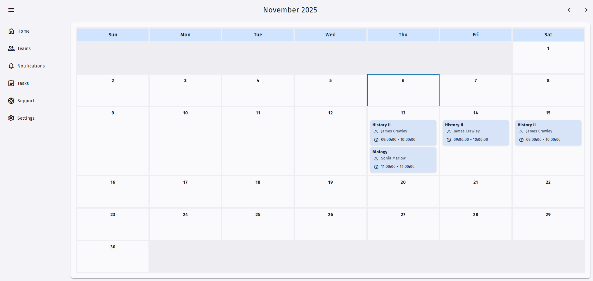

# Fullstack Calendar

## Screnshots


## About the project
A calendar and appointment manager built with **PHP**, **MySQL**, **JavaScript**, **HTML**, and **CSS**.

## Features
- ✅ Add, edit, and delete appointments
- ✅ Support for **multi-day** events
- ✅ Handle **overlapping** bookings
- ✅ Set **start/end time slots**
- ✅ Navigate between months
- ✅ Dropdown controls for managing multiple bookings per day

## Tech stack
- **Frontend**: HTML, CSS ([beercss](https://github.com/beercss/beercss)), JavaScript 
- **Backend**: PHP (Procedural)
- **Database**: MySQL
- **Architecture**: MVC-inspired folder structure

## Instructions
Create a database on MySQL
Create a table using the appointments.sql file
Create a .env file on root with the following variables:

```c
DB_HOST= *localhost or any url*
DB_USER=
DB_PASSWORD=
```